## 跟踪一次完整的 message 记录过程

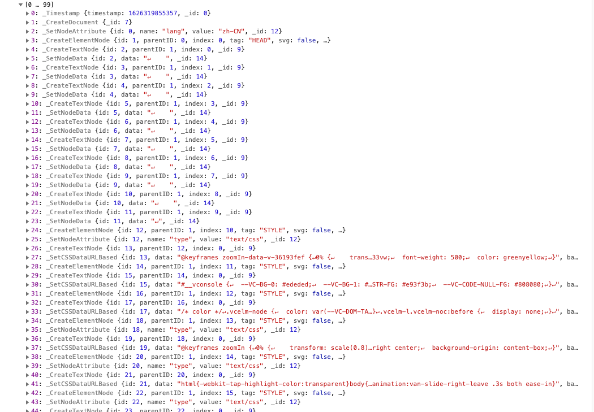
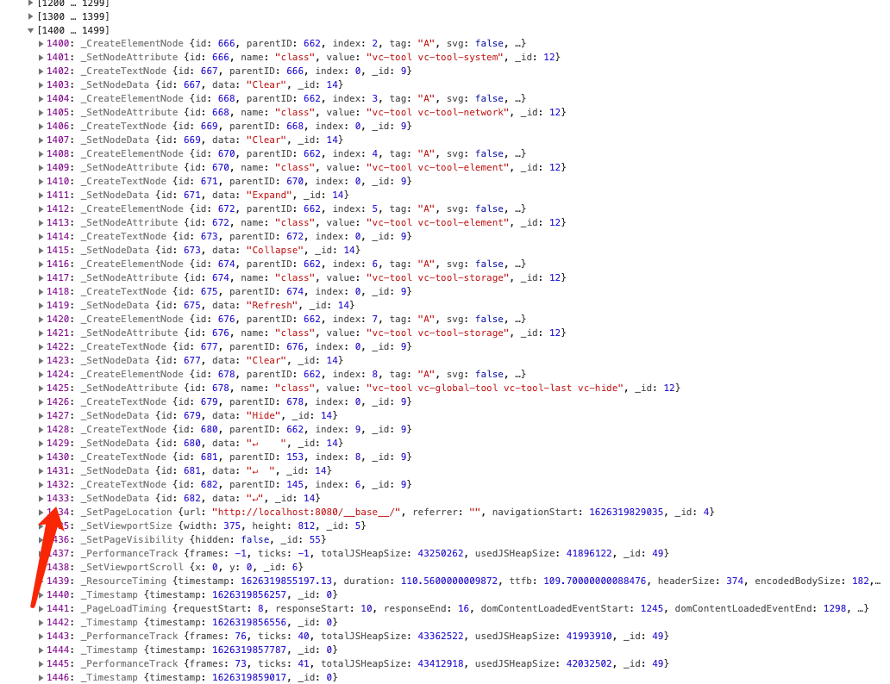

首先以`Timestamp`开头，这在每批数据开头都会自动添加的。然后就是对整个dom树的序列化，用了大概1400多个message来记录，中间会忽略特定的标签，比如`meta`、`link`、`title`、`script`
等，此过程依据不同的文档大小有所不同。 从上面的截图中可以知道，本次的dom序列化占用了1433个message。

接下来是一个`SetPageLocation`、`SetViewportSize`，`SetPageVisibility`，`SetViewportScroll`。

接下来就是一些性能方面的数据，比如`PerformanceTrack`、`ResourceTiming`、`PageLoadTiming`、`PageRenderTiming`。

此时，如果页面上没有任何事件的话，则只会出现`Timestamp`和`PerformanceTrack`这两个消息，如下：

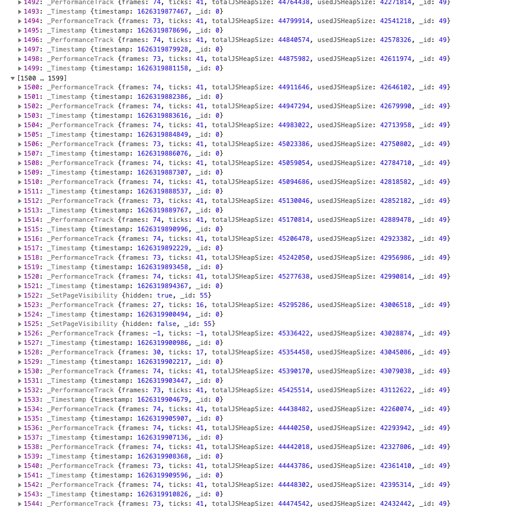

中间会夹杂着一些特定操作导致的事件，比如js异常:

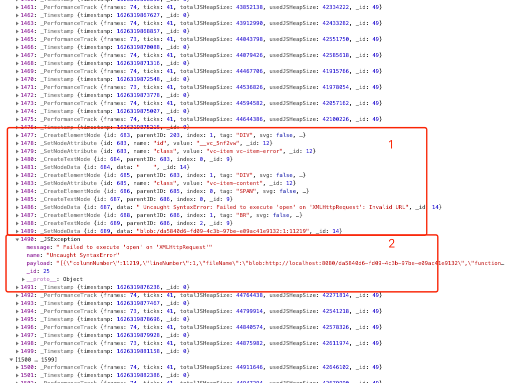

上面这张图中，js异常也会导致dom的变化，这是因为项目中开启了vConsole，而vConsole记录的数据都是通过dom保存的。

本次录制过程中，也出现了2条`ConnectionInformation`异常的事件：

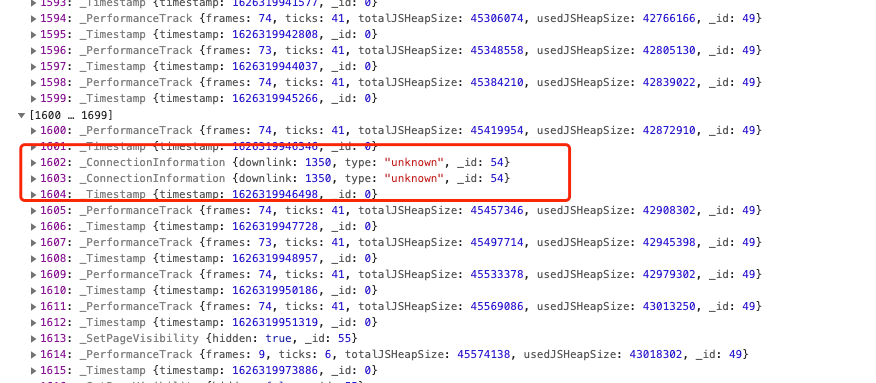

以及切换浏览器tab导致的`SetPageVisibility`事件：

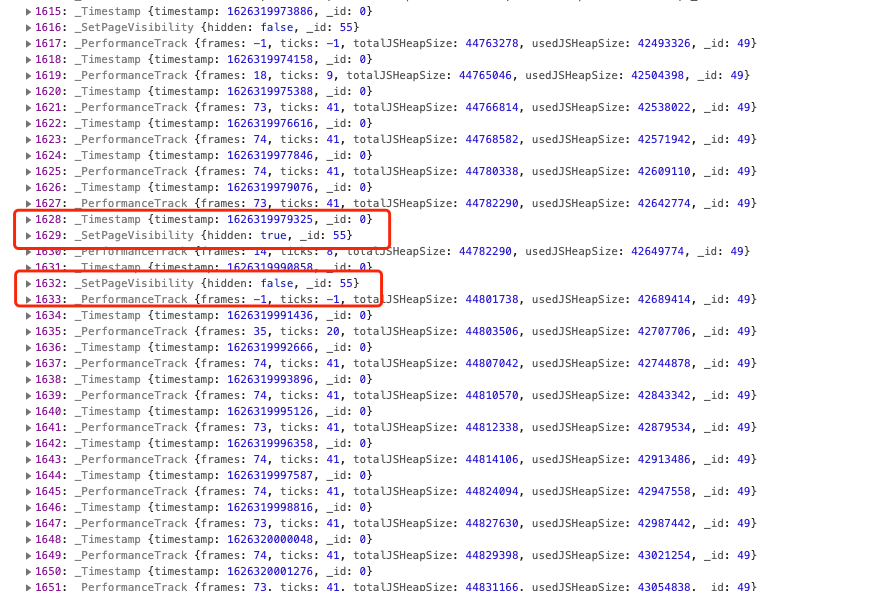

`LongTask`事件：

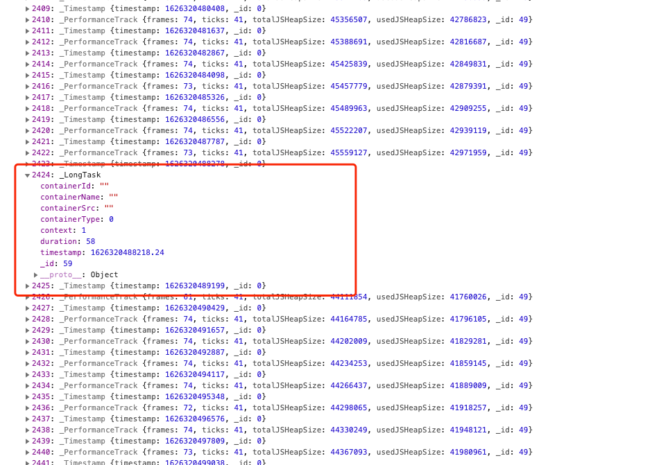
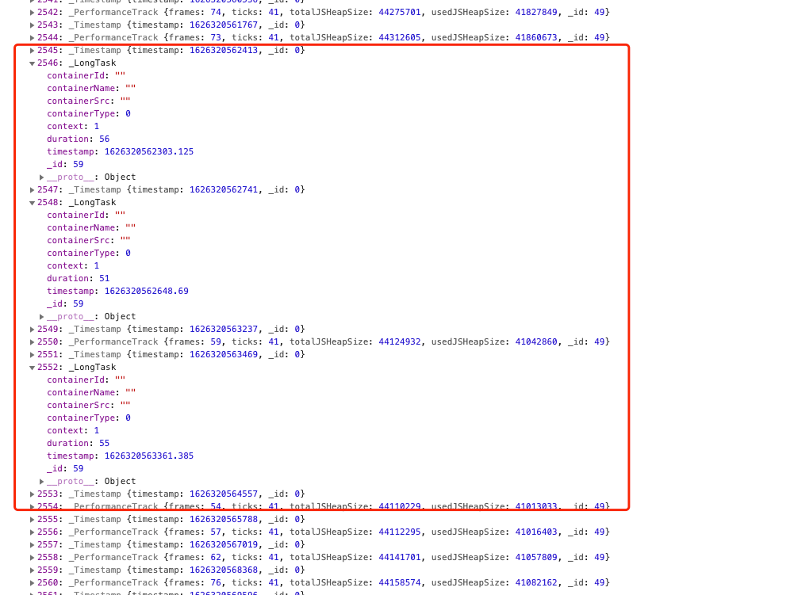

通过观察本次录制的数据，发现中间突然多了这样一些记录：
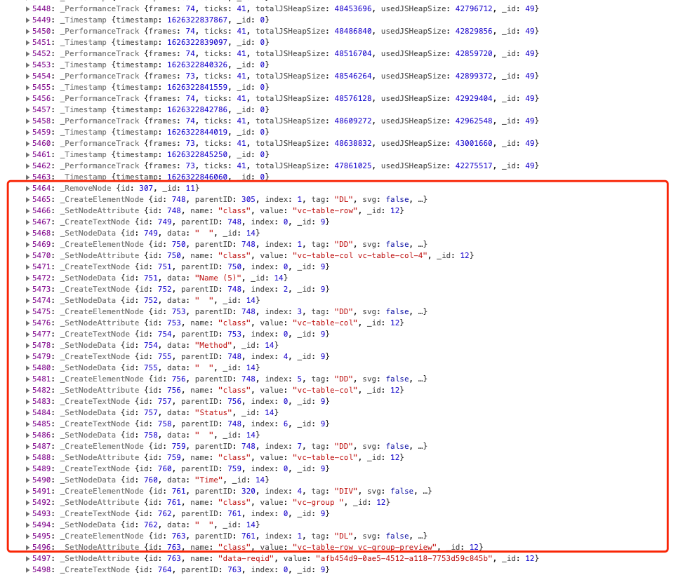
通过分析，知道了这些dom操作原来是本地发送的请求导致的，如下：
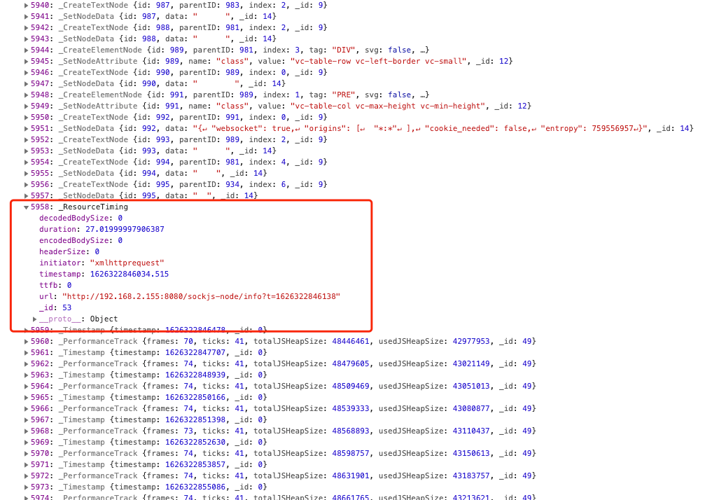

由此可知，接口调用对应的消息类型是`ResourceTiming`。我们可以屏蔽vConsole所在的根元素，避免这部分不必要的记录。

下面是点击页面上面的按钮，跳转新页面的过程：
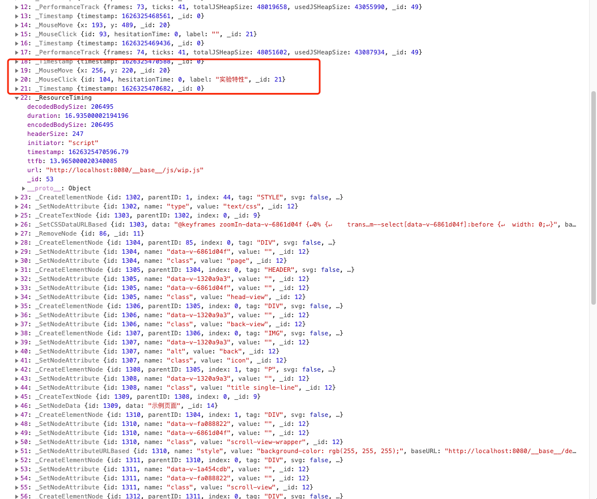
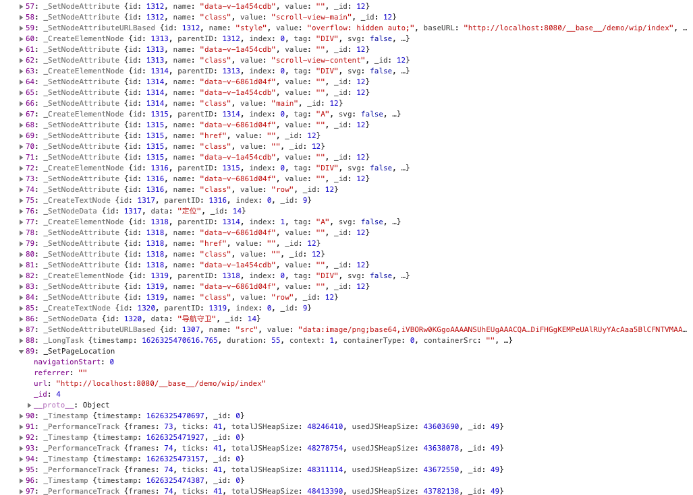

从图中可知，先是`MouseMove`、`MouseClick`事件，`MouseClick`的`label`就是按钮的名字。然后跟着一个`ResourceTiming`
事件，表示动态加载资源，也就是我们的新页面的js，因为我们项目开启了动态import路由的机制。 接下来就是把新页面渲染到视图中，也就是一系列dom操作。最后有一个`SetPageLocation`，表示我们的路由已经导航到新的页面地址了。

## 总结

`tracker`会对整个dom树进行一个序列化操作，以`CreateDocument`事件开头。而要想序列化整个dom树，避免不了对整个dom树的遍历，查看源码知道，`tracker`采用如下的方式对dom树进行的遍历：

```js
function bindTree(node) {
    this.bindNode(node);

    const walker = document.createTreeWalker(
        node,
        NodeFilter.SHOW_ELEMENT + NodeFilter.SHOW_TEXT,
        {
            acceptNode: (node) =>
                isIgnored(node) || this.app.nodes.getID(node) !== undefined
                    ? NodeFilter.FILTER_REJECT
                    : NodeFilter.FILTER_ACCEPT,
        },
        false,
    );

    while (walker.nextNode()) {
        this.bindNode(walker.currentNode);
    }
}

bindTree(document.documentElement);
```
可以看到，这个过滤器只会过滤出`ELEMENT`和`TEXT`类型的节点。

而上面我们知道，在记录的事件里面没有看到`title`、`meta`、`script`等这些节点，而这是由于`isIgnored`函数的原因：
```js
function isIgnored(node) {
    // 文本节点不忽略
    if (node instanceof Text) {
        return false
    }
    // 非元素节点忽略
    if (!(node instanceof Element)) {
        return true
    }
    const tag = node.tagName.toUpperCase()
    if (tag === 'LINK') {
        const rel = node.getAttribute('rel')
        const as = node.getAttribute('as')
        // 样式相关的link不忽略
        if (rel?.includes('stylesheet') || ['style', 'font'].includes(as)) {
            return false
        }
        // 其他类型的link都忽略
        return true
    }
    
    // 忽略下面这些元素
    return ['SCRIPT', 'NOSCRIPT', 'META', 'TITLE', 'BASE'].includes(tag)
}
```

## 关于资源加载

被跟踪的网站的所有外部资源，比如`style`、`image`、`font`等，在后端数据处理过程中会经由worker下载到`MinIO`缓存中，然后重写元素的属性(比如`href`等)。如此，在回放的时候，这些资源都是来自于`MinIO`缓存，而不受原有网站更新的影响。
具体可查看这个[issue](https://github.com/openreplay/openreplay/issues/47#issuecomment-865063128)

后续版本中，这些资源的url重写会放在`tracker`里面去做，这样在后端就可以避免掉无用的解码工作。

`script`不会被缓存，在回放的时候也不会被执行，因为脚本的执行可能会引起一些副作用。

